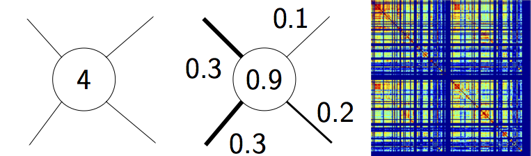
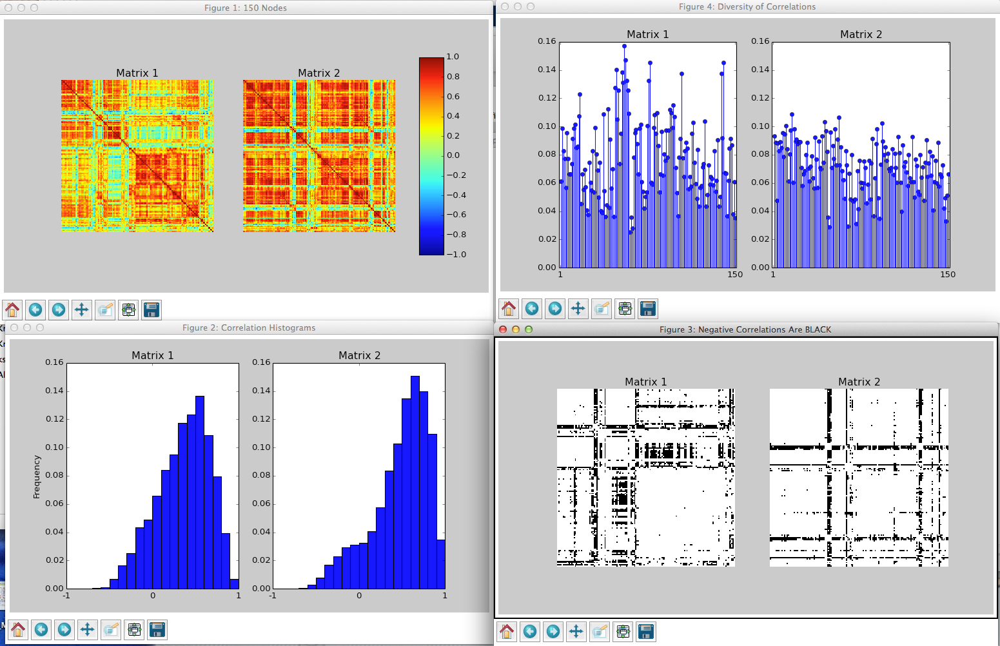
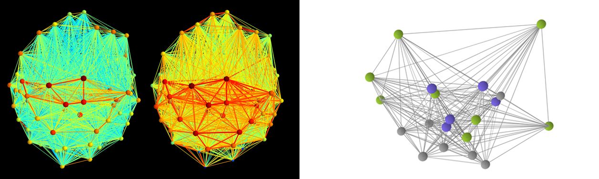

.. Analytic Tools documentation master file, created by
   sphinx-quickstart on Wed Sep 13 10:39:06 2017.
   You can adapt this file completely to your liking, but it should at least
   contain the root `toctree` directive.

.. title:: Analytic Tools Documentation

Welcome to the Analytic Tools Documentation!
============================================ 

If you are reading this, you probably got here from GitHub_. This is the reference manual detailing
the routines and modules of our computational tools for neuroscience package. If you have any questions
or comments please do not hesitate to contact |sfemail|. 

**Note:** These pages contain documentation *only*, to download the code, please
refer to the corresponding GitHub_ repository. 

We can only see further by standing on the shoulders of giants - thus, all routines discussed here
make heavy use of numerous third party packages. At the very least, NumPy_, 
`SciPy <http://www.scipy.org>`_ and `Matplotlib <http://matplotlib.sourceforge.net/>`_
need to be installed on your system in order to use our codes. The following table provides a brief
overview of available routines sorted by application area.

|br|

.. cssclass:: table-hover

+-------------------------+------------------------------+---------------------------------------------+
| **Applications**        | **Routines**                 |   **Brief Description**                     |
+-------------------------+------------------------------+---------------------------------------------+
| |NWTools|_              | |nwmlink|                    |   Computation of simple graph metrics       |
|                         +------------------------------+---------------------------------------------+
|                         | |corrlink|                   |   Calculation of the statistical dependence |
|			  |				 |   between sets of time-series	       |
|                         +------------------------------+---------------------------------------------+
|                         | |nwplink|                    |   Thresholding, group-averaging and         |
|                         |                              |   random graph construction                 |
|                         +------------------------------+---------------------------------------------+
|                         | |vislink|                    |   Illustration of networks in 2D/3D         |
|                         +------------------------------+---------------------------------------------+
|                         | |misclink|                   | Quality of life improvements for dealing    |
|			  |				 | with graphs in Python		       |
+-------------------------+------------------------------+---------------------------------------------+
| |IntVis|_		  | |plotlylink|		 | Embedding of networks in three-dimensional  |
|			  |				 | brain surfaces			       |
+-------------------------+------------------------------+---------------------------------------------+
| |EEGTools|_		  | |eeglink|			 | Pre-processing of intracranial EEG data     |
|                         +------------------------------+---------------------------------------------+
|			  | |pipelinelink|		 | Data analysis and assessment                |
+-------------------------+------------------------------+---------------------------------------------+
| |StatsTools|_		  | |statslink|			 | Group-level statistical inference           |
+-------------------------+------------------------------+---------------------------------------------+
| |Recipes|_		  | |arraylink|			 | Viewing, changing and selecting arrays and  |
|			  |				 | their elements			       |
|                         +------------------------------+---------------------------------------------+
|			  | |filelink|			 | Inspection, selection and management of     |
|			  |				 | files and directories		       |
+-------------------------+------------------------------+---------------------------------------------+
| |NModel|_               | |simlink|                    | Routines                                    |
|                         |                              | to run a simulation with our                |
|			  |				 | neural population model		       |
|                         +------------------------------+---------------------------------------------+
|                         | |toollink|                   | Tools to incorporate coupling matrices      |
|                         |                              | and brain parcellations into our model      |
+-------------------------+------------------------------+---------------------------------------------+

.. |nwmlink| replace:: :ref:`Network Metrics <nwmetrics>`
.. |corrlink| replace:: :ref:`Statistical Dependence Matrices <corrmats>`
.. |nwplink| replace:: :ref:`Network Processing <nwprocess>`
.. |vislink| replace:: :ref:`Network Visualization <visualization>`
.. |misclink| replace:: :ref:`Miscellaneous <misc>`
.. |plotlylink| replace:: :ref:`JavaScript/Plotly Interface <jsplotly>`
.. |eeglink| replace:: :ref:`Read and Convert Raw iEEG Recordings <ieegreading>`
.. |pipelinelink| replace:: :ref:`iEEG Processing Pipeline <ieegpipeline>`
.. |statslink| replace:: :ref:`Permutation Testing <permtesting>`
.. |recipeslink| replace:: :ref:`Permutation Testing <permtesting>`
.. |arraylink| replace:: :ref:`Array Assessment and Manipulation <arrayfuncs>`
.. |filelink| replace:: :ref:`File Operations <filefuncs>`
.. |simlink| replace:: :ref:`Launching a Simulation <simulate>`
.. |toollink| replace:: :ref:`Working with the Model <tools>`

.. _NWTools: #networksection
.. |NWTools| replace:: **Network Science**

.. _IntVis: #plotlysection
.. |IntVis| replace:: **Interactive Brain Network Visualization**

.. _EEGTools: #eegsection
.. |EEGTools| replace:: **Intracranial EEG Data Processing**

.. _StatsTools: #statssection
.. |StatsTools| replace:: **Comparative Statistics**

.. _Recipes: #recipesection
.. |Recipes| replace:: **General-Purpose Convenience Functions**

.. _NModel: #modelsection
.. |NModel| replace:: **Neural Population Modeling**
			
Getting Started
===============

.. currentmodule:: nws_tools

The source code of this package is hosted at GitHub_. To use the package, create a new directory
and either click on the big green download button on the top right of the GitHub_ page, or open a terminal,
go to the newly created directory and type

   ::

     $ git clone https://github.com/pantaray/Analytic-Tools

Launch Python_ (we recommend using an `iPython <http://ipython.org/>`_ shell) and type

   ::

     >>> from analytical_tools import *

to import the entire collection of modules provided in the package. To import only the network science module,
for instance, use

   ::

     >>> from analytical_tools import nws_tools

Then typing

   ::

     >>> nws_tools.normalize?

in iPython will display help test for the function :func:`normalize` of the network science module ``nws_tools.py``. 

.. _networksection:

Network Science
===============

.. currentmodule:: nws_tools

The Python module ``nws_tools.py`` represents a collection of routines for the creation,
processing, analysis and visualization of functional brain networks
(or, in general: *weighted, undirected networks*). 

.. _nwmetrics:

Network Metrics
---------------

   Illustration of three basic graph metrics. Nodal degree quantifies the number
   of connected edges per node (left), nodal strength reflects the sum of connected
   link weights (weighted degree) (middle), while connection density denotes the
   ratio of actual to maximally possible edges in the network (right). 

Three basic routines are provided to compute nodal degree and strength as well as connection density 
of an undirected graph. Note that similar functions are part of the Brain Connectivity Toolbox 
for Python (`bctpy <https://pypi.python.org/pypi/bctpy>`_). For convenience the routines are included in
``nws_tools`` anyway in case `bctpy <https://pypi.python.org/pypi/bctpy>`_ is not available.

Click on a specific routine to see more details. 

.. autosummary::
   :toctree: _stubs

   degrees_und 
   strengths_und
   density_und

.. _corrmats:

Statistical Dependence Matrices
-------------------------------

   Exemplary output of the routine :func:`corrcheck` showing two Pearson correlation matrices.

The routines below may be used to generate, process and visually inspect functional connection matrices 
based on different notions of statistical dependence. 

.. autosummary::
   :toctree: _stubs

   get_corr 
   mutual_info
   corrcheck
   rm_negatives
   rm_selfies
   issym

.. _nwprocess:

Network Processing
------------------
A collection of routines providing means to average and threshold networks as well as to generate a number of null model graphs. 

.. autosummary::
   :toctree: _stubs

   get_meannw
   thresh_nws
   generate_randnws

.. _visualization:

Network Visualization
---------------------

   Two functional brain networks generated using :func:`shownet` (left)
   and a graph rendered with :func:`show_nw` (right). 

The following routines may be useful for rendering networks using either 
`Mayavi <http://code.enthought.com/projects/mayavi/>`_ or 
`Matplotlib <http://matplotlib.sourceforge.net/>`_. 

.. autosummary::
   :toctree: _stubs

   shownet
   show_nw
   csv2dict

.. _misc:

Miscellaneous
-------------

Routines that may come in handy when working with networks and large data files. 

.. autosummary::
   :toctree: _stubs

   normalize
   nw_zip
   hdfburp
   printdata
   img2vid

.. _plotlysection:

Interactive Brain Network Visualization
=======================================

.. currentmodule:: plotly_tools

The module ``plotly_tools.py`` can be used to automate common laborious tasks when
creating interactive visualizations of networks embedded in three-dimensional renderings
of brain surfaces using `Plotly <https://plot.ly/>`_. 

.. _jsplotly:

JavaScript/Plotly Interface
---------------------------

.. figure:: ../pix/brainsurf.png
   :figwidth: 40%
   :alt: brainsurf
   :align: center

   Exemplary rendering of the brain surface `BrainMesh_Ch2withCerebellum`
   provided in the HDF5 container ``brainsurf.h5`` located in the ``brainsurf``
   sub-directory of the package. 

These functions might simplify the creation of HTML files with `Plotly <https://plot.ly/>`_. 

.. autosummary::
   :toctree: _stubs

   cmap_plt2js
   make_brainsurf

.. _eegsection:

Intracranial EEG Data Processing
================================

.. currentmodule:: eeg_tools

The module ``eeg_tools.py`` contains a number of routines that we developed for our research
in human intracranial electrophysiology.

**Note:** These codes are work in progress designed with our specific workflow requirements
in mind. If you need a widely tested, full-fledged general purpose toolbox to analyze
electrophysiological data, consider using `FieldTrip <http://www.fieldtriptoolbox.org/>`_. 

.. _ieegreading:

Read and Convert Raw iEEG Recordings
------------------------------------
Two routines to (1) read raw iEEG recordings from `*.eeg/*.21E` files and store the data in
more accessible `HDF5 <https://support.hdfgroup.org/HDF5/>`_ containers and (2) subsequently
access the generated data-sets. 

.. autosummary::
   :toctree: _stubs

   read_eeg
   load_data

.. _ieegpipeline:

iEEG Processing Pipeline
------------------------

.. figure:: ../pix/ieeg_source.png
   :figwidth: 60%
   :alt: ieeg_source
   :align: center

   Pre-processed 10-channel iEEG segment. 

Functions to perform routine tasks on (pre-processed) iEEG recordings. 

.. autosummary::
   :toctree: _stubs

   bandpass_filter
   MA
   time2ind

.. _statssection:

Comparative Statistics
======================

.. currentmodule:: stats_tools

The module ``stats_tools.py`` may be used to assess the statistical significance of group-level differences
in two-sample problems. 

.. _permtesting:

Permutation Testing
-------------------
The core of this module is a wrapper that invokes third party packages to perform group-level statistical inference.
Thus, depending on the use-case the Python packages 
`MNE <https://martinos.org/mne/stable/index.html>`_, `Pandas <http://pandas.pydata.org/>`_,
`rpy2 <https://rpy2.bitbucket.io/>`_, as well as the external software environment `R <https://www.r-project.org/>`_
including the `R`-library `flip <https://cran.r-project.org/web/packages/flip/index.html>`_ are required. 

.. autosummary::
   :toctree: _stubs

   perm_test
   printstats

.. _recipesection:

General-Purpose Convenience Functions
=====================================

.. currentmodule:: recipes

The module ``recipes.py`` represents a collection of tools to perform a variety of common tasks one tends to run into
when working with NumPy_ arrays and large file cohorts in Python_. 

.. _arrayfuncs:

Array Assessment and Manipulation
---------------------------------
Most of these routines encapsulate code segments that repeatedly proved to be useful when performing seemingly
"straight-forward" operations on NumPy_ arrays. 

.. autosummary::
   :toctree: _stubs

   natural_sort
   regexfind
   query_yes_no

.. _filefuncs:

File Operations
---------------
A few file-system I/O functions that might make everyday read/write operations a little less tedious. 

.. autosummary::
   :toctree: _stubs

   myglob
   get_numlines
   moveit

.. _modelsection:

Neural Population Modeling
==========================
In contrast to the tools discussed above, the source code of the Python_/Cython_ implementation of our
neural population model is not encapsulated in a single module. Thus, more than one ``*.py`` file
is required to perform a neural simulation. 

More specifically, the code-base of the model makes extensive use
of Cython_, an optimizing static compiler providing C extensions for Python. Thus, unlike pure
Python modules, to run a simulation the model sources have to be built first.
To do that, Cython needs to be installed (please refer to
`these guides <http://docs.cython.org/en/latest/src/quickstart/install.html>`_
for installation instructions). Further, to accelerate matrix-vector multiplications, our code relies on
`CBLAS <http://www.netlib.org/blas/#_cblas>`_ routines
and thus requires a full installation of the CBLAS library (including header files).
Once these dependencies are installed, open a terminal in the directory you downloaded the Analytic Tools package to
and type 

   ::

     $ make all

This will first convert the Cython module ``the_model.pyx`` to a C source code file ``the_model.c``,
which will be subsequently compiled and linked based on the options specified in ``setup.py`` to generate
a shared object called ``the_model.so``. Now, the model is ready to perform simulations. 

The Simulation Module
---------------------

.. currentmodule:: sim_tools

To streamline the generation of whole brain simulations, a Python module called ``sim_tools.py``
is provided that acts as a launch manager and is intended as "Pythonic" layer between the user and
the model's C-extension. Note that the use of ``sim_tools.py`` is encouraged but not required - feel free
to write your own management routines by looking at the source code of the function :func:`run_model`
in ``sim_tools.py``.

.. _simulate:

Launching a Simulation
++++++++++++++++++++++

.. figure:: ../pix/modeling.png
   :figwidth: 60%
   :alt: modeling_sim
   :align: center

   Exemplary simulations compared to empirical BOLD signals.

The following routines in ``sim_tools.py`` are intended to run simulations and plot the corresponding
results. 

.. autosummary::
   :toctree: _stubs

   run_model
   make_bold
   plot_sim
   
.. _tools:

Working with the Model
++++++++++++++++++++++
The functions below are not essential for using the model, but might come in handy nonetheless. 

.. autosummary::
   :toctree: _stubs

   show_params
   make_D

.. |sfemail| raw:: html

	

	
.. |br| raw:: html

    

.. _GitHub: https://github.com/pantaray/Analytic-Tools

.. _Python: https://www.python.org/

.. _NumPy: http://numpy.org

.. _Cython: http://cython.org/

